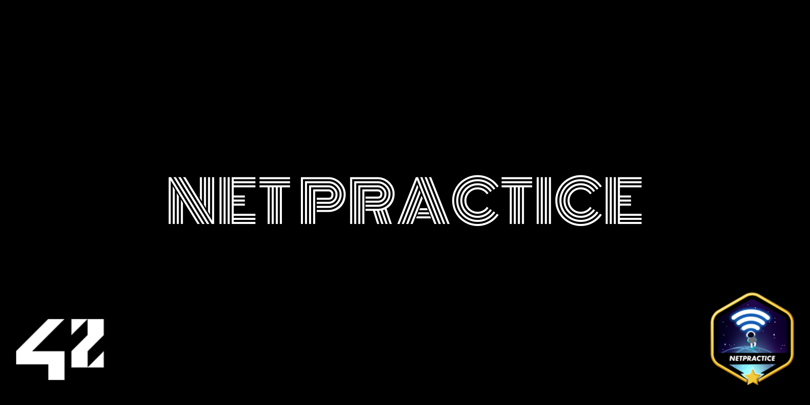
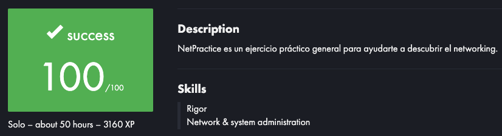

# NetPractice

---

---

## ✅ Evaluation

---

## 📚 Table of Contents

1. 🧠 What is NetPractice?
2. 📦 What’s inside?
3. ⚙️ How does it work?
4. 🧠 Learning Resources
5. 📸 Screenshots
6. 🚀 About Me
7. 📄 License

---

## 🧠 What is NetPractice?

**NetPractice** is a networking project from the 42 Common Core.

It teaches the fundamentals of **IP addressing**, **subnetting**, and **routing** through a fully visual and interactive interface.

📡 You'll have to configure correct IP addresses, subnet masks, and routes between devices to achieve full network connectivity.

---

## 📦 What’s inside?

| Folder / File | Description |
| --- | --- |
| `exercises/` | Solutions and configurations with explanations |
| `images/` | Screenshots and network topology examples |
| `README.md` | This very documentation you’re reading |

> ⚠️ This is a visual project — no source code involved.
> 

---

## ⚙️ How does it work?

Your goal in each level is to connect **all devices correctly**.

✔ Assign a **valid IP address** to each host

✔ Use the correct **subnet mask**

✔ Add **manual routes** to reach remote networks

💡 Visual connections are not enough. Always use `ping` to verify actual connectivity.

---

## 🧠 Tips and Learning Resources

### 🎥 YouTube Series: **You SUCK at Subnetting** (by NetworkChuck)

This series helped me grasp subnetting concepts easily and visually:

1. [EP 1 – What is an IP Address?](https://youtu.be/5WfiTHiU4x8)
2. [EP 2 – What is a Subnet Mask?](https://youtu.be/AQDCe585Lnc)
3. [EP 3 – IP Address Classes](https://youtu.be/tAnYkqVrD5M)
4. [EP 4 – What is CIDR?](https://youtu.be/w0R5c3VLWgA)
5. [EP 5 – Private IPs and Public IPs](https://youtu.be/g7h8gyFqwZQ)
6. [EP 6 – Let’s Subnet Your Home Network](https://youtu.be/okN2iHx4V1E)
7. [EP 7 – Subnetting in the Real World](https://youtu.be/0EQMGzZEmMM)
8. [EP 8 – VLSM (Variable Length Subnet Masking)](https://youtu.be/RZJLZQJzPWE)
9. [EP 9 – Do You STILL Suck at Subnetting? (Final Test)](https://youtu.be/_nClS-JWhmc)

> 🧠 Highly recommended — funny, clear, and full of practical examples.
> 

---

## 📸 Screenshots

---

## 🚀 About Me

🎓 I’m currently a student at **42 Madrid** (Spain)

💻 Passionate about systems, networking, and visual learning.

🌐 More about me at [**volmer.es**](https://volmer.es/)

🔗 [LinkedIn – Juan Bautista Delorme](https://www.linkedin.com/in/juanbautistadelorme/)

---

## 📄 License

This project is part of 42’s educational curriculum.

External resources are credited to their authors and shared here for learning purposes only.